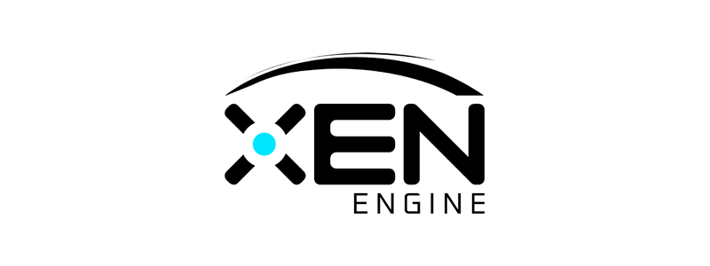
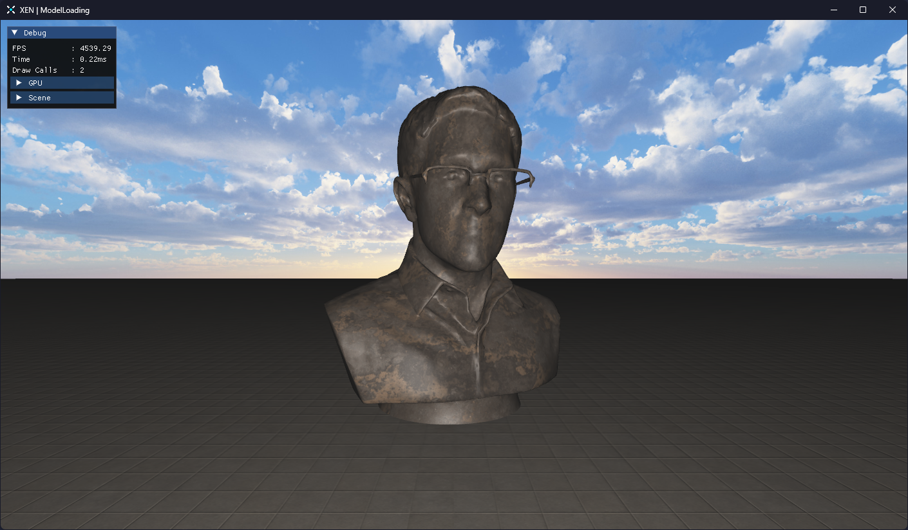

## What is XEN?

**XEN** is just another game engine project based on OpenGL (4.6). It provides a [Core](Core) static library (XEN-Core)
that
can be linked against to build games and other 3D tools.

#### ▶️ To see XEN in action, you can browse and build the projects provided in the [Examples](Examples) directory.

*(Example "ModelLoading" renders a floor and statue with basic lighting)*

## 📚 Third Party Dependencies

See [DEPENDENCIES](DEPENDENCIES.md) for information regarding XEN's use of 3rd party libraries.

## 🏗️ Creating Projects

XEN provides a [Python script](Scripts/CreateNewProject.py) for generating a new project. Projects must be added
to [Projects.cmake](Projects.cmake)
and the XEN project reconfigured before the project can be compiled.

## ⚖️ License

XEN is licensed under the [ISC License](LICENSE). Third party files included are all licensed
under their respective licenses, viewable [here](Licenses).